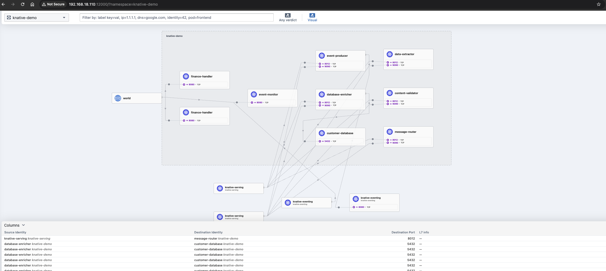

# Knative Eventing Learning Demo

A **complete educational project** demonstrating Knative Eventing patterns with **NO paid APIs required**. Learn event-driven architecture with Kafka, PostgreSQL, and Knative.

## 🎯 Learning Objectives

This project teaches you:

1. **Knative Eventing Fundamentals**
   - CloudEvents format
   - Brokers and Triggers
   - Event filtering
   - Request-Reply pattern
   - SinkBinding

2. **Event-Driven Architecture Patterns**
   - Event sourcing
   - Saga pattern
   - Content-based routing
   - Dead letter queues
   - Event enrichment

3. **Kubernetes & Knative Integration**
   - Knative Serving (auto-scaling)
   - Kafka integration via Strimzi
   - PostgreSQL integration
   - Real-time dashboards

## 🏗️ Architecture



### System Overview

```
                          ┌─────────────────────────────────────┐
                          │    Customer/External System         │
                          └──────────────┬──────────────────────┘
                                         │ HTTP POST
                                         │ {"content": "..."}
                                         ▼
                          ┌──────────────────────────────────────┐
                          │      EVENT PRODUCER                  │
                          │  (Knative Service, min-scale=1)      │
                          │                                      │
                          │  • Receives HTTP POST requests       │
                          │  • Validates JSON payload            │
                          │  • Creates CloudEvent wrapper        │
                          │  • Publishes to Kafka Broker         │
                          └──────────────┬───────────────────────┘
                                         │ CloudEvent
                                         │ type: com.learning.message.received
                                         ▼
              ┌──────────────────────────────────────────────────────┐
              │           KAFKA BROKER (Knative Eventing)            │
              │                                                      │
              │  • Receives events via kafka-broker-ingress          │
              │  • Stores in Kafka topic                             │
              │  • Dispatches via kafka-broker-dispatcher            │
              │  • Manages subscriptions (Triggers)                  │
              └──┬───────────────────────────────────────────────┬───┘
                 │                                               │
                 │ Trigger: type=message.received                │ ALL EVENTS
                 ▼                                               │ (no filter)
  ┌──────────────────────────────────┐                          │
  │     DATA EXTRACTOR               │                          │
  │  (Knative Service, scale-to-0)   │                          │
  │                                  │                          │
  │  • Extracts email via regex      │                          │
  │  • Extracts name via regex       │                          │
  │  • Extracts phone via regex      │                          │
  │  • Detects sentiment (keywords)  │                          │
  │  • Adds extracted fields to evt  │                          │
  └──────────────┬───────────────────┘                          │
                 │ CloudEvent                                    │
                 │ type: com.learning.message.extracted          │
                 ▼                                               │
  ┌──────────────────────────────────┐                          │
  │    CONTENT VALIDATOR             │                          │
  │  (Knative Service, scale-to-0)   │                          │
  │                                  │                          │
  │  • Checks for spam keywords      │                          │
  │  • Checks for profanity          │                          │
  │  • Validates message length      │                          │
  │  • Checks URL safety             │                          │
  │  • Sets validation_status flag   │                          │
  └──────────────┬───────────────────┘                          │
                 │ CloudEvent                                    │
                 │ type: com.learning.message.validated          │
                 ▼                                               │
  ┌──────────────────────────────────┐                          │
  │   DATABASE ENRICHER              │                          │
  │  (Knative Service, scale-to-0)   │                          │
  │            │                     │                          │
  │            ▼                     │                          │
  │   ┌──────────────────┐          │                          │
  │   │  PostgreSQL DB   │          │                          │
  │   │  20 customers    │          │                          │
  │   └──────────────────┘          │                          │
  │                                  │                          │
  │  • Queries DB by email           │                          │
  │  • Adds customer_id, tier        │                          │
  │  • Adds account_status           │                          │
  │  • Adds lifetime_value           │                          │
  └──────────────┬───────────────────┘                          │
                 │ CloudEvent                                    │
                 │ type: com.learning.message.enriched           │
                 ▼                                               │
  ┌──────────────────────────────────┐                          │
  │     MESSAGE ROUTER               │                          │
  │  (Knative Service, scale-to-0)   │                          │
  │                                  │                          │
  │  • Keyword matching (finance)    │                          │
  │  • Keyword matching (support)    │                          │
  │  • Keyword matching (website)    │                          │
  │  • Weighted scoring algorithm    │                          │
  │  • Routes to highest score       │                          │
  └──┬────────────────┬──────────────┘                          │
     │                │                                          │
     │ type: routed.  │ type: routed.                           │
     │     finance    │     support                             │
     ▼                ▼                                          ▼
┌─────────────┐  ┌─────────────┐                    ┌──────────────────┐
│  FINANCE    │  │  SUPPORT    │                    │  EVENT MONITOR   │
│  HANDLER    │  │  HANDLER    │                    │  (Dashboard)     │
│ (Deployment)│  │ (Deployment)│                    │  (Deployment)    │
│             │  │             │                    │                  │
│ • Web UI    │  │ • REST API  │                    │ • Receives ALL   │
│ • SSE feed  │  │ • In-memory │                    │   event types    │
│ • Inbox     │  │   storage   │                    │ • SSE dashboard  │
│   display   │  │ • Message   │                    │ • Real-time flow │
│             │  │   log       │                    │   visualization  │
└─────────────┘  └─────────────┘                    └──────────────────┘
```

### Traffic Flow Details

**1. Ingress → Event Producer**
- Protocol: HTTP POST
- Port: 80/8080
- Payload: `{"content": "user message"}`
- Response: `{"event_id": "...", "status": "success"}`

**2. Event Producer → Kafka Broker**
- Protocol: HTTP (CloudEvents binary mode)
- Destination: `kafka-broker-ingress.knative-eventing:80`
- Headers: `ce-type`, `ce-source`, `ce-id`, `ce-specversion`
- Body: Event data payload

**3. Kafka Broker → Kafka Cluster**
- Protocol: Kafka protocol (9092)
- Topic: `knative-broker-knative-demo-learning-broker`
- Message: Serialized CloudEvent
- Replication: 1 (single broker)

**4. Kafka Broker → Service Subscribers (via Triggers)**
- Protocol: HTTP POST (CloudEvents)
- Dispatcher: `kafka-broker-dispatcher`
- Filtering: Event type matching
- Retry: 3 attempts with exponential backoff
- Concurrency: Parallel delivery to matching triggers

**5. Inter-Service Communication**
- Each service receives event → processes → publishes new event
- New event goes back to broker → triggers next service
- Request-Reply pattern with event transformation

**6. Database Enricher → PostgreSQL**
- Protocol: PostgreSQL wire protocol (5432)
- Connection: `customer-database.knative-demo.svc.cluster.local:5432`
- Query: `SELECT * FROM customers WHERE email = $1`
- Connection pooling: Single connection per pod

**7. Handlers (Finance/Support/Monitor)**
- Always-on deployments (not auto-scaling)
- Event Monitor uses wildcard trigger (no filter)
- Finance/Support filtered by event type
- SSE connections for real-time UI updates

## 📦 Services Overview

| Service | Purpose | Scaling | Traffic In | Traffic Out | Processing |
|---------|---------|---------|------------|-------------|------------|
| **event_producer** | HTTP API entry point | Min: 1, Max: 5 | HTTP POST from clients | CloudEvents to Broker | Validates JSON, wraps in CloudEvent, publishes |
| **data_extractor** | Extract structured data | Scale-to-zero | CloudEvents from Broker | CloudEvents to Broker | Regex extraction: email, name, phone, sentiment |
| **content_validator** | Content safety checks | Scale-to-zero | CloudEvents from Broker | CloudEvents to Broker | Spam detection, profanity filter, length check |
| **database_enricher** | Customer data lookup | Scale-to-zero | CloudEvents from Broker<br>PostgreSQL queries | CloudEvents to Broker | DB query by email, add customer metadata |
| **message_router** | Content-based routing | Scale-to-zero | CloudEvents from Broker | CloudEvents to Broker | Keyword matching, scoring, route selection |
| **finance_handler** | Finance inbox UI | Always-on (1 pod) | CloudEvents from Broker<br>HTTP (UI access) | SSE to browsers | Store messages, serve web UI, SSE stream |
| **support_handler** | Support message log | Always-on (1 pod) | CloudEvents from Broker<br>HTTP (REST API) | JSON responses | Store messages, REST API for retrieval |
| **event_monitor** | Observability dashboard | Always-on (1 pod) | ALL CloudEvents<br>HTTP (UI access) | SSE to browsers | Capture all events, serve dashboard, SSE stream |

### Event Types & Flow

```
com.learning.message.received       → Published by: event_producer
                                    → Consumed by: data_extractor, event_monitor

com.learning.message.extracted      → Published by: data_extractor
                                    → Consumed by: content_validator, event_monitor

com.learning.message.validated      → Published by: content_validator
                                    → Consumed by: database_enricher, event_monitor

com.learning.message.enriched       → Published by: database_enricher
                                    → Consumed by: message_router, event_monitor

com.learning.message.routed.finance → Published by: message_router
                                    → Consumed by: finance_handler, event_monitor

com.learning.message.routed.support → Published by: message_router
                                    → Consumed by: support_handler, event_monitor

com.learning.message.routed.website → Published by: message_router
                                    → Consumed by: event_monitor (no handler yet)
```

### Network Ports

| Service | Port | Protocol | Purpose |
|---------|------|----------|---------|
| event-producer | 8080 | HTTP | Receive POST requests, health checks |
| data-extractor | 8080 | HTTP | Receive CloudEvents, health checks |
| content-validator | 8080 | HTTP | Receive CloudEvents, health checks |
| database-enricher | 8080 | HTTP | Receive CloudEvents, health checks |
| message-router | 8080 | HTTP | Receive CloudEvents, health checks |
| finance-handler | 8080 | HTTP | Receive CloudEvents, serve UI, SSE |
| support-handler | 8080 | HTTP | Receive CloudEvents, REST API |
| event-monitor | 8080 | HTTP | Receive CloudEvents, serve dashboard, SSE |
| customer-database | 5432 | PostgreSQL | Database queries |
| kafka-broker-ingress | 80 | HTTP | CloudEvent ingress |
| kafka-broker-dispatcher | - | HTTP | CloudEvent egress to subscribers |
| my-cluster-kafka | 9092 | Kafka | Broker communication |


## 📦 Services Overview

| Service | Purpose | Pattern Demonstrated | API Needed |
|---------|---------|---------------------|------------|
| **event_producer** | Accepts HTTP requests, publishes CloudEvents | SinkBinding, Event Publishing | ❌ None |
| **data_extractor** | Extracts structured data (email, name) | Request-Reply, Regex Processing | ❌ None |
| **content_validator** | Validates content safety | Event Filtering, Conditional Routing | ❌ None |
| **database_enricher** | Enriches with customer data | Database Integration, Event Enrichment | ❌ None |
| **message_router** | Routes based on content | Content-Based Routing | ❌ None |
| **finance_handler** | Handles finance messages | Event Consumer, Web UI | ❌ None |
| **support_handler** | Handles support messages | Event Consumer, Web UI | ❌ None |
| **event_monitor** | Real-time event dashboard | Wildcard Filtering, SSE | ❌ None |

## 🚀 Quick Start

### Prerequisites

1. **Kubernetes cluster** with:
   - Knative Serving
   - Knative Eventing
   - Strimzi (Kafka operator)
   - Knative Kafka Broker

2. **Tools**:
   - `kubectl`
   - `docker`
   - Access to container registry

### Installation

```bash
# 1. Clone and navigate
cd knative-eventing-learning-demo

# 2. Configure your registry
cp .env.example .env
# Edit .env with your Docker Hub username

# 3. Build all services
./scripts/build-all.sh

# 4. Deploy to Kubernetes
./scripts/deploy.sh

# 5. Test the system
./scripts/test.sh
```

## 📚 Learning Scenarios

### Scenario 1: Basic Event Flow
**Learn**: CloudEvents, Broker, Triggers

```bash
# Send a simple message
curl -X POST http://event-producer.demo.example.com \
  -H "Content-Type: application/json" \
  -d '{"content": "Hello World"}'

# Watch events flow through the system
kubectl port-forward -n knative-demo svc/event-monitor 9999:80
# Open http://localhost:9999
```

### Scenario 2: Data Extraction
**Learn**: Event transformation, Request-Reply pattern

```bash
# Send message with email and name
curl -X POST http://event-producer.demo.example.com \
  -H "Content-Type: application/json" \
  -d '{
    "content": "Hi, my name is John Doe and my email is john@example.com"
  }'

# See extracted data in event monitor
```

### Scenario 3: Content Validation
**Learn**: Conditional routing, Dead letter queue

```bash
# Send message with spam keywords
curl -X POST http://event-producer.demo.example.com \
  -H "Content-Type: application/json" \
  -d '{
    "content": "Click here for free spam virus phishing"
  }'

# This will be routed to review queue
```

### Scenario 4: Database Enrichment
**Learn**: External system integration, Event enrichment

```bash
# Send message with known customer email
curl -X POST http://event-producer.demo.example.com \
  -H "Content-Type: application/json" \
  -d '{
    "content": "I need help. My email is john.smith@globaltech.com"
  }'

# Customer data from PostgreSQL will be added to event
```

### Scenario 5: Content-Based Routing
**Learn**: Event filtering, Multiple subscribers

```bash
# Finance message
curl -X POST http://event-producer.demo.example.com \
  -H "Content-Type: application/json" \
  -d '{
    "content": "I have a billing issue with my invoice payment"
  }'

# Support message
curl -X POST http://event-producer.demo.example.com \
  -H "Content-Type: application/json" \
  -d '{
    "content": "The app is broken and I need help troubleshooting"
  }'

# Each routes to different handler
```

## 🔧 Technology Stack

- **Knative Serving** - Serverless deployment
- **Knative Eventing** - Event routing
- **Strimzi** - Kafka operator
- **Kafka** - Event broker
- **PostgreSQL** - Customer database
- **Python/Flask** - Service implementation
- **Docker** - Containerization

